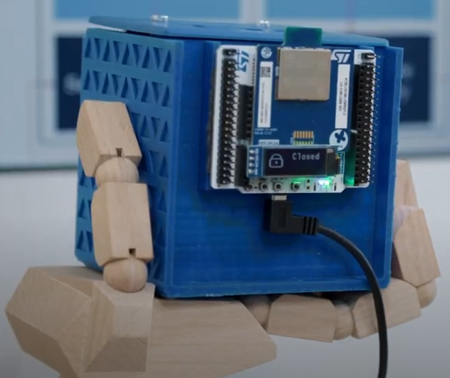

## <b>Application License Clarification</b>

The TF-M application components are licensed by ST under Ultimate Liberty
license SLA0044. Read the file q_a.txt for Application License Clarification.

## <b>Introduction </b>



This project illustrates how to create a Bluetooth Low Energy Secure Application
 on STM32WBA in a TrustZoned environment running the TF-M.

The Bluetooth Low Energy application runs as the Non-secure Processing 
Environment (NSPE) while the TF-M runs in the Secure Processing Environment (SPE). 
Both environments are securely booted by mcuboot, which is in charge of verifying
 the authenticity & integrity of both images and eventually decrypts newly 
 installed image after an image update.

Doorlock application allows a user to connect with a smartphone using BLE and 
securely unlock the door if allowed to.
 
The TF-M provides a Root of Trust solution including Secure Boot and 
Secure Firmware Update functionalities that is used before executing the 
application and provides TF-M secure services that are isolated from the 
Non-secure application but can be used by the Non-secure application at run-time.  

TF-M application is based on the Open-Source TF-M reference implementation 
that has been ported on STM32 microcontroller to take benefit of STM32 HW 
security features such as CM33 TrustZone/MPU, TrustZone aware peripherals, 
Memory protections (HDP, WRP) and enhanced life cycle scheme.  

The Secure Boot and Secure Firmware Update solution allows the update of the 
STM32 microcontroller built-in program with new firmware versions, adding new 
features and correcting potential issues. The update process is performed in 
a secure way to prevent unauthorized updates and access to confidential 
on-device data:  

-   The Secure Boot (Root of Trust services) is an immutable code, always 
executed after a system reset, that checks STM32 static protections, 
activates STM32 runtime protections and then verifies the authenticity 
(RSA or ECDSA signature) and integrity (SHA256) of the application code 
before execution to ensure that invalid or malicious 
code cannot be run. The default asymmetric key (RSA or ECDSA) is taken from 
TFM_SBSFU_Boot\Src\keys.c 
and is embedded in the provisioned data area in the secure boot and secure 
firmware update binary.  


-   The Secure Firmware Update application is an immutable code that detects 
that a new firmware image is available, and that checks its authenticity and 
integrity. It also decrypts it (AES-CTR) during installation if image is installed in internal flash. 
The AES-CTR key is encrypted (RSA-OAEP or ECIES-P256) and provided in the 
firmware image itself. The default asymmetric key (RSA or ECDSA) used to 
encrypt the AES-CTR key is distinct from the signature key, but also taken 
from TFM_SBSFU_Boot\Src\keys.c. 
The firmware update can be done either on the secure part of firmware 
image and/or on the Non-secure part of the firmware image.  

The secure services are an updatable code implementing a set of services 
managing critical assets that are isolated from the Non-secure application 
so that the Non-secure application can't access directly to any of the critical 
assets but can only use secure services that use the critical assets:  

-   Crypto: secure cryptographic services based on opaque key APIs  

-   Secure Storage: protect data Confidentiality/authenticity/Integrity  

-   Internal Trusted Storage: protect data in internal flash  

-   Attestation: prove product identity via Entity Attestation Token  

## <b>Doorlock demonstration</b>

### <b>Software</b>

In this demonstrator, the term "door" refers to: 
-   An electromagnet connected to a GPIO allowing to hold/release 
a ferromagnetic element. 
-   An I²C LCD screen printing the status of the door.

The door is connected to the Secure side and a Trusted Service is dedicated to 
the door management. 
If a vulnerability would be found in the NSPE and exploited, it would be 
impossible for an attacker to change the door state without the proper 
authentication.

Upon user connection with a smartphone, a Bluetooth Low Energy service 
(called Doorlock Service "DLS") allows the user to exchange with a 
trusted Service located in the TF-M in the Secure side of the STM32WBA. This 
trusted service uses a 128bit AES key stored in the Secure data part. This same 
key is embedded in the smartphone and a simple crypto challenge allows the 
Trusted Service to authenticate the smartphone.

To demonstrate the bootloader image update features, the 128bit AES used by the 
Trusted Service can be updated. An OTA Bluetooth Service allows the user to 
update a new image to the Secure data download slot.
This image is pushed encrypted and signed to the STM32WBA, upon reboot, mcuboot 
will decrypt and authenticate the newly pushed Secure data and eventually 
install this new image to the Secure data slot.

Two files ready to be uploaded (signed & encrypted with the default 
demonstration keys) are already present in
the project :
 - ```TFM_SBSFU_Boot\Src\user\user1_tfm_s_data_enc_sig.bin```
 - ```TFM_SBSFU_Boot\Src\user\user2_tfm_s_data_enc_sig.bin```


### <b>Hardware</b>

The board used in this demonstrator is a NUCLEO-WBA52CG.

The LCD is connected to the following GPIO:
```
PA7: SDA
PA6: SCL
PA2: VCC
PA1: GND
```

The Electromagnet is connected to the following GPIO:
```
PB13: Electromagnet control
```

### <b>References</b>

LCD: https://www.amazon.fr/dp/B079H2C7WH/ref=psdc_2908498031_t2_B07D9H83R4?th=1

Electromagnet: https://wiki.seeedstudio.com/Grove-Electromagnet/


### <b>Directory contents</b>

- 3D_Printings:
	3D files to be printed if the physical Doorlock is needed.

All these directories are relatives to following folder:
```Projects/NUCLEO-WBA52CG/Applications/TFM```

   - Linker:
        Linker files definition shared between TFM_SBSFU_Boot,
        TFM_Appli and TFM_Loader projects.

   - TFM_SBSFU_Boot:
        Secure boot and secure firmware update application.  

   - TFM_Appli:
        Secure services application and example of Non-secure user application.  

   - TFM_Loader:
        Local loader application. This application is not used in the current demonstration
		but left in the directory for reference.


### <b>How to use it ?</b>

Several steps to run TF-M application :  

<b>0. Prerequisite</b>

   1. imgtool
   
   Two versions of imgtool (used during build process) are available in mcuboot  
   middleware: windows executable and python version. By default, the windows  
   executable is selected. It is possible to switch to python version by:  
   - installing python (Python 3.6 or newer) with the required modules from  
     Middlewares\Third_Party\mcuboot\scripts\requirements.txt:  
      ```
      pip install -r requirements.txt  
      ```
   - having python in execution path variable  
   - deleting imgtool.exe in Middlewares\Third_Party\mcuboot\scripts\dist\imgtool 
   
   2. Initial Secure partition creation & Environment variable
   
   Some of the source files used in the TFM_Appli Secure are automatically generated with a prebuild script.
   Unfortunately, all the source files need to be present on the project before IAR is able to run a prebuild script.
   
   The solution is to run the prebuild script outside IAR the first time:
   ```init_project.bat```
   
   As Windows and IAR doesn't support path too long, an environment variable called "FIRMWARE_BASE_DIR" 
   has been added to reference sources. This previous script will also customize this environment variable with your own environment


<b>1. Build</b>

   Build the TF-M projects in the following order. This is mandatory as each projects requests some objects generated by the compilation of the previous one:  
   
   
   1. Build TFM_SBSFU_Boot project.
   
		This step creates the secure boot and secure firmware update binary including provisioned user data (keys, IDs...).
		Depending on toolchain, it is located here:  
			```EWARM:        TFM_SBSFU_Boot\EWARM\NUCLEO-WBA52CG\Exe\Project.bin```


   2. Build TFM_Appli Secure project.
   
		This step creates the TFM Application Secure binary:  
			```EWARM:        TFM_Appli\EWARM\Secure\NUCLEO-WBA52CG_S\Exe\Project.bin```  
		It also produces the clear TFM Secure app signed image for initial installation in  TFM_Appli\Binary\tfm_s_app_init.bin, the encrypted TFM Secure app signed image for download in  
			```TFM_Appli\Binary\tfm_s_app_enc_sign.bin```  
		and the clear TFM Secure app signed image for download in  
			```TFM_Appli\Binary\tfm_s_app_sign.bin``` 


   3. Build TFM_Appli Non-secure project.

		This step creates the TFM Application Non-secure binary:  
			```EWARM:        TFM_Appli\EWARM\NonSecure\NUCLEO-WBA52CG_NS\Exe\Project.bin```  
		It also produces the clear TFM Non-secure app signed image for initial installation in  
			```TFM_Appli\Binary\tfm_ns_app_init.bin```,  
		the encrypted TFM Non-secure app signed image for download in  
			```TFM_Appli\Binary\tfm_ns_app_enc_sign.bin```  
		and the clear TFM Non-secure app signed image for download in  
			```TFM_Appli\Binary\tfm_ns_app_sign.bin```.    


   4. Generate Secure and Non-secure Data images
   
		Execute dataimg script:  
			```EWARM:        TFM_SBSFU_Boot\EWARM\dataimg.bat```  
		It produces the clear TFM Secure and Non-secure data signed images for initial installation in  
			```TFM_Appli\Binary\tfm_s_data_init.bin and TFM_Appli\Binary\tfm_ns_data_init.bin```,  
		the encrypted TFM Secure and Non-secure data signed images for download in  
			```TFM_Appli\Binary\tfm_s_data_enc_sign.bin and TFM_Appli\Binary\tfm_ns_data_enc_sign.bin```,  
		and the clear TFM Secure and Non-secure data signed images for download in  
			```TFM_Appli\Binary\tfm_s_data_sign.bin and TFM_Appli\Binary\tfm_ns_data_sign.bin```.    

		The TF-M Secure data signed image contains initial attestation private key for TF-M service. 
		The TF-M Non-secure data signed image contains dummy data for this example.  


<b>2. Initialize the device</b>

Depending on your toolchain, execute regression script (relying on 
STM32CubeProgrammer CLI tool) to easily perform device initialization in one 
shot:  
```
    EWARM:        TFM_SBSFU_Boot\EWARM\regression.bat
```

As an alternative, it is also possible to initialize and verify manually the 
Option Bytes by means of STM32CubeProgrammer GUI tool.

<b>3. Use a terminal emulator</b>

   Serial port configuration should be :
   - Baud rate    = 115200
   - Data         = 8 bits
   - Parity       = none
   - Stop         = 1 bit
   - Flow control = none  
Terminal emulator is used for UART connection with the board.
Connect terminal emulator to COM port of the board.  
The terminal emulator is used to log TF-M information.  


<b>4. Program the TF-M into flash</b>

Program the TFM_SBSFU_Boot binary, the clear signed TFM_Appli Secure image for initial installation, 
and the clear signed TFM_Appli Non-secure image for initial installation.

Program as well the TF-M Secure and Non-secure data signed images for initial installation into internal flash.  

Depending on your toolchain, execute script TFM_UPDATE (relying on STM32CubeProgrammer CLI tool) to easily program the TF-M into device internal 
flash in one shot:  
```
    EWARM:        TFM_SBSFU_Boot\EWARM\TFM_UPDATE.bat
```


<b>5. Program the device Option Bytes</b>

Depending on your toolchain, execute script hardening (relying on 
STM32CubeProgrammer CLI tool) to easily program the right Option Bytes in one shot:  
```
    EWARM:        TFM_SBSFU_Boot\EWARM\hardening.bat
```


<b>6. TrustZone deactivation</b>

   After having executed this application, the TZEN option bit is set.  
   TZEN option bit must be reset to allow execution of any other non TrustZone application. To perform that, refer to AN5347.
   
### <b>Known limitations</b>

  - IAR build not working if cube package is installed on a path with a space, or a long path.  
  - KEIL and STM32CubeIDE not supported.  
